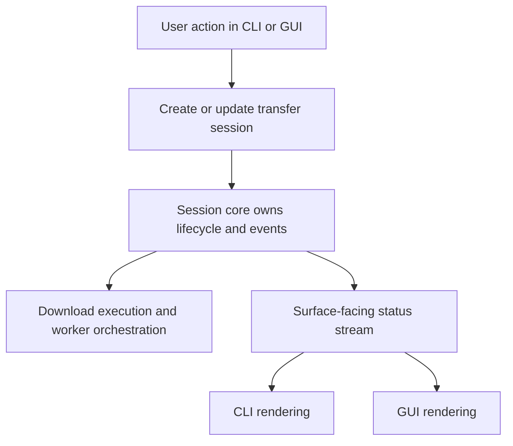

# Session-Centered Core for Giga Grabber

## Problem Frame

`giga-grabber` currently shares real downloader behavior across `src/app.rs`, `src/cli.rs`, `src/worker/mod.rs`, and `src/mega_client.rs`, but the shared behavior is expressed mostly through direct wiring instead of one explicit session model. That makes testing, safer refactors, and cross-surface parity harder than they should be.

The goal of this effort is to make transfer execution and lifecycle behavior easier to reason about by introducing a session-centered core that both CLI and GUI consume. The first version should prioritize testability and safer change over restart persistence. Moderate workflow cleanup is allowed when it helps the core model, but this is not a broad product redesign.

## Requirements

**Session Model**
- R1. The system must define one explicit in-memory transfer session that owns the lifecycle of the current active download set.
- R2. The session model must support adding new transfers into the existing active session while it is running.
- R3. The system must allow at most one active session at a time, and that session remains alive until all of its transfers reach terminal states.
- R4. CLI and GUI must both interact with the same session lifecycle model rather than maintaining separate behavior rules for state transitions.
- R5. The first version must keep session state in memory only; surviving process restart is out of scope for this phase.

**Surface Integration**
- R6. The CLI and GUI must consume session updates through a shared status/event model that is consistent enough to support equivalent underlying lifecycle behavior across both surfaces.
- R7. This refactor may introduce small import or queue behavior adjustments only when needed to fit the one-session model, but it must not broaden into a full redesign of importing, queueing, settings, or general surface flows.
- R8. The architecture must preserve existing core user capabilities: starting downloads from public MEGA links, queueing multiple files, pause/resume, cancellation, retries, and completion/error reporting.
- R9. In v1, the CLI remains a one-shot driver and observer over the shared session lifecycle; it does not need full session-management controls beyond current command-driven execution and progress reporting.
- R10. In v1, append-to-active-session is exposed through the GUI only; the core session model supports it, but the CLI does not need separate append controls beyond its current one-shot invocation model.

**Testability and Change Safety**
- R11. The session-centered core must support focused automated testing of lifecycle behavior without needing full CLI or GUI integration for every case.
- R12. The resulting design must make it easier to change transfer behavior in one place without needing parallel edits in both surfaces for the same logical rule.
- R13. The refactor must improve clarity around ownership boundaries between transfer lifecycle, download execution, and surface presentation.

## Success Criteria

- Session lifecycle rules are described once and used by both CLI and GUI.
- A transfer can be added to the current active session without creating a second concurrent session model.
- The active session closes automatically only after all queued, paused, retry-waiting, and actively downloading transfers have drained into terminal states.
- The CLI reuses the shared session lifecycle without needing GUI-level interactive session controls in v1.
- The GUI can append transfers into the active session in v1 without requiring equivalent append controls in the CLI.
- A planner can define tests around session behavior without inventing a second behavior model for one of the surfaces.
- Any user-visible cleanup stays limited to import or queue adjustments required by the one-session model.
- Future reliability work can build on the session core without first untangling surface-specific lifecycle logic again.

## Scope Boundaries

- Restart persistence for queued or active sessions is explicitly out of scope for this first version.
- This work does not require a full import-flow redesign or staged-link inbox.
- This work does not require a background service or daemon model.
- This work may reassign lifecycle ownership, but it does not replace the existing worker/download pipeline in v1.
- This work does not require changing the project’s supported MEGA link types or transport behavior.

## Key Decisions

- **Use a session-centered core instead of a thinner helper extraction:** the main payoff is clearer lifecycle ownership, not just moving code into a new module.
- **Use one appendable active session in v1:** users add transfers into the current session instead of creating parallel sessions, and the session ends only after all nonterminal transfers drain into terminal states.
- **Keep CLI parity internal in v1:** the CLI should reuse the shared lifecycle model and status flow, but it stays a one-shot execution surface rather than a full session-control client.
- **Expose append in the GUI first:** the core must support adding transfers to the active session, but only the GUI needs to surface that capability in v1.
- **Keep user-visible cleanup narrow in v1:** only small import or queue adjustments are allowed when required by the one-session model; broader flow normalization stays out of scope.
- **Keep v1 in memory:** the first cut should improve testability and refactor safety without taking on durable-state design at the same time.

## Dependencies / Assumptions

- Existing capabilities in `src/app.rs`, `src/cli.rs`, `src/worker/mod.rs`, and `src/mega_client.rs` remain the behavioral baseline unless explicitly cleaned up during planning.
- The current worker/download pipeline is strong enough to remain the execution backbone; this brainstorm is about lifecycle ownership and surface integration, not replacing the downloader protocol logic.

## Outstanding Questions

### Resolve Before Planning

None.

### Deferred to Planning

- [Affects R6, R11][Technical] What is the smallest shared event/status model that gives both CLI and GUI parity without overfitting to the current Iced message flow?
- [Affects R7, R13][Technical] Where should the boundary sit between session lifecycle ownership and lower-level worker execution responsibilities?
- [Affects R8, R12][Needs research] Which existing surface behaviors differ today in ways that planning should either preserve or intentionally normalize?

## Next Steps

-> `/ce:plan` for structured implementation planning
