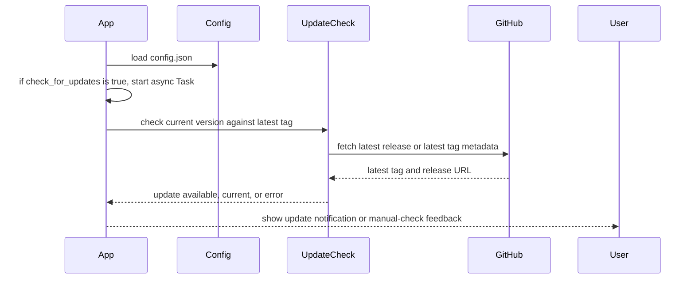

# feat: Latest version/update check

## Problem Frame

Giga Grabber currently has no in-app way to tell users when a newer release is available. Issue #26 asks for a GUI update check that compares the locally installed Cargo package version with the latest GitHub release tag, informs the user when a newer version exists, links to the release page, and lets users turn automatic checks off or run a manual check from Settings.

The app is a Rust iced GUI with a CLI fallback. This plan targets GUI behavior only. The CLI should not gain update-check behavior unless implementation discovers that a shared module cannot be cleanly isolated from CLI builds.

---

## Requirements Trace

- R1. Check the latest GitHub tag with the existing `reqwest` HTTP client dependency.
- R2. Compare the latest GitHub tag against the local installed Cargo package version from `Cargo.toml`, currently `1.3.2`.
- R3. Notify the GUI user with a modal, dialog, or toast when a newer version is available.
- R4. Include a link to the latest release page in the notification path.
- R5. Add a Settings option to disable automatic update checks.
- R6. Add a Settings control for a manual update check.
- R7. Keep existing `config.json` files valid by using serde defaults for the new config field only.
- R8. Do not add auto-download or self-update behavior.
- R9. Do not add CLI update-check behavior unless shared code makes it unavoidable.

---

## Local Context

- `Cargo.toml` declares package version `1.3.2`, uses Rust edition 2024, enables GUI by default, and already includes `reqwest = "0.13"` with `json`, `stream`, `socks`, and `rustls` features.
- `src/config.rs` owns `Config`, default values, `config.json` load/save, normalization, and validation. Existing config files are deserialized through serde, so adding a persisted flag needs a serde default.
- `src/screens/settings.rs` renders Settings, owns editable config state, defines `SettingsMessage`, and returns `settings::Action` values to the app.
- `src/app.rs` owns app state, app startup, route/view selection, async iced `Task` orchestration, and the existing `error_modal` state.
- `src/helpers.rs` defines the GUI `Message`, `Route`, `mega_builder`, and `runner_worker` patterns that app-level work should follow.
- `src/components/error_modal.rs` is the existing modal pattern. It currently supports a message and an Ok button, with no release-link action.
- CodeGraph is not initialized for this repo, so planning context came from direct file reads.
- `node_modules/` exists as an untracked local directory and must not be committed or included in implementation artifacts.

---

## Scope Boundaries

### In Scope

- GUI update-check domain logic and HTTP client behavior.
- Persisted opt-out setting for automatic checks.
- Startup automatic check when enabled.
- Manual check from Settings regardless of whether automatic checks are disabled.
- User-visible notification when a newer version exists, including a path to open the latest release page.
- User-visible feedback for manual checks when the app is current or the check fails.
- Focused tests and verification guidance for the new domain logic, config behavior, app orchestration, and settings interactions.

### Out of Scope

- Auto-download, self-update, installer launch, or replacing the running binary.
- CLI update checks, CLI flags, or CLI notifications unless unavoidable because shared compile-time version code requires minimal exposure.
- Speculative compatibility behavior beyond serde defaults needed for existing `config.json` files.
- Broad redesign of modals, Settings layout, or app navigation.
- Dependency upgrades beyond what implementation proves necessary for this feature.

### Deferred to Follow-Up Work

- A richer toast system if the current modal/dialog path proves too limited for polished notifications.
- Release-note preview content inside the app.

---

## Key Technical Decisions

1. Add a small update-check module instead of embedding GitHub HTTP parsing in `src/app.rs`. This keeps version parsing, GitHub response handling, and comparison behavior testable without starting the GUI.
2. Use `env!("CARGO_PKG_VERSION")` or `CARGO_PKG_VERSION` at compile time for the local app version instead of reading `Cargo.toml` at runtime. The package version remains the source for the installed binary, while runtime file reads would be brittle after installation.
3. Represent the user notification as app state rather than reusing `error_modal: Option<String>` directly. Update availability is not an error, and the release link requires an action beyond closing the modal.
4. Store the settings flag as a positive boolean such as `check_for_updates` defaulting to `true`. This matches the requirement to allow disabling checks while preserving automatic checks for existing users after adding the field.

---

## High-Level Technical Design

This illustrates the intended approach and is directional guidance for review, not implementation specification. The implementing agent should treat it as context, not code to reproduce.

---

## Implementation Units

### U1. Update-Check Domain and GitHub Client

**Goal:** Add a testable update-check domain module that fetches the latest GitHub release/tag metadata with `reqwest`, parses the tag into a comparable version, compares it with the local Cargo package version, and returns an outcome the GUI can render.

**Requirements:** R1, R2, R3, R4, R8, R9

**Dependencies:** None

**Files:**

- `src/update_check.rs`
- `src/main.rs`
- `Cargo.toml`
- `src/update_check.rs` test module

**Approach:**

- Define a small result shape for `Available`, `Current`, and `Failed` outcomes. The available outcome should include the latest version/tag and the latest release URL.
- Use the existing `reqwest` dependency. Prefer a passed-in or locally built `reqwest::Client` so the module can be tested without coupling to the Mega client.
- Query the GitHub endpoint that gives enough data for the latest release page link. If the issue truly requires tags rather than releases, still provide a deterministic link to the release page for the resolved tag.
- Normalize tags that include a leading `v` before comparison.
- Compare semantic versions against the local compile-time Cargo package version. Keep pre-release behavior simple and explicit in tests.
- Gate the module for GUI use in `src/main.rs` so CLI-only builds do not gain update-check behavior.

**Patterns to Follow:**

- `src/helpers.rs` builds `reqwest::Client` through a narrow helper and returns typed errors through existing Rust result patterns.
- `src/config.rs` keeps small domain helpers close to their related state and tests private behavior through module tests.

**Test Scenarios:**

- In `src/update_check.rs` test module, given local version `1.3.2` and latest tag `v1.3.3`, checking returns `Available` with version `1.3.3` and the release URL.
- In `src/update_check.rs` test module, given local version `1.3.2` and latest tag `1.3.2`, checking returns `Current`.
- In `src/update_check.rs` test module, given local version `1.3.2` and latest tag `v1.2.9`, checking returns `Current` rather than downgrading.
- In `src/update_check.rs` test module, given a malformed tag, parsing returns a failure outcome or error that the app can display for manual checks.
- In `src/update_check.rs` test module, given GitHub metadata with a tag and release HTML URL, the release URL is preserved exactly for the GUI action.

**Verification:**

- The update-check module can be exercised without launching iced.
- Version comparison does not depend on reading `Cargo.toml` at runtime.
- GitHub response parsing keeps enough data for the notification link.

### U2. Config Persistence Flag

**Goal:** Persist whether automatic update checks are enabled while keeping existing `config.json` files valid.

**Requirements:** R5, R7

**Dependencies:** None

**Files:**

- `src/config.rs`
- `src/config.rs` test module

**Approach:**

- Add a `check_for_updates` boolean to `Config` with a default of `true`.
- Use serde default handling on the new field so existing `config.json` files that lack it still load.
- Include the field in `Default` and saved config output.
- Do not add migration formats, legacy aliases, or extra compatibility branches beyond the serde default.

**Patterns to Follow:**

- `src/config.rs` already centralizes defaulting, normalization, validation, and save/load behavior.
- Existing `Config::new()` fallback behavior should remain unchanged for invalid config files.

**Test Scenarios:**

- In `src/config.rs` test module, deserializing a config JSON object without `check_for_updates` yields `check_for_updates == true`.
- In `src/config.rs` test module, deserializing a config JSON object with `check_for_updates: false` preserves `false`.
- In `src/config.rs` test module, serializing `Config::default()` includes `check_for_updates: true`.
- In `src/config.rs` test module, validation behavior for proxy settings is unchanged when the update-check flag is present.

**Verification:**

- Existing config files without the new field still load.
- Saving settings writes the flag into `config.json`.

### U3. App Orchestration for Startup and Manual Checks

**Goal:** Wire update checks into `App` startup and manual Settings actions using iced `Task` without blocking the UI.

**Requirements:** R1, R2, R3, R5, R6, R9

**Dependencies:** U1, U2

**Files:**

- `src/app.rs`
- `src/helpers.rs`
- `src/screens/settings.rs`
- `src/app.rs` test module, if app update logic is unit-testable in place

**Approach:**

- Add app-level messages for starting and completing update checks. Keep manual and automatic checks distinguishable so completion feedback can differ.
- On startup, return an iced `Task` from `App::new` only when `settings.config.check_for_updates` is true.
- Let Settings emit an action for manual check. `App::update` should convert that action into an async iced `Task`.
- Avoid duplicate user notifications if an automatic check is already running and the user requests a manual check. A simple in-flight flag is enough if needed.
- Automatic check failures should not show a scary error modal on startup. Manual check failures should give clear user feedback because the user requested the action.
- Keep all orchestration inside GUI-gated code paths.

**Patterns to Follow:**

- `src/app.rs` already maps screen actions into iced `Task` values in the `Import` and `Settings` branches.
- `src/helpers.rs` is the central place for the GUI `Message` enum, so new app messages should fit that pattern.

**Test Scenarios:**

- In `src/app.rs` test module, when config has `check_for_updates == true`, startup schedules an update-check task or reaches the app state that causes one to be scheduled.
- In `src/app.rs` test module, when config has `check_for_updates == false`, startup does not schedule an automatic update-check task.
- In `src/app.rs` test module, when Settings emits a manual-check action, `App::update` starts an update-check task even if automatic checks are disabled.
- In `src/app.rs` test module, an automatic check failure leaves the app usable and does not replace an existing unrelated error modal.
- In `src/app.rs` test module, a manual check failure produces user-visible feedback.

**Verification:**

- Startup remains non-blocking.
- Manual checks are reachable from Settings.
- CLI execution paths are not changed except for shared module compilation.

### U4. User Notification Modal and Release Link

**Goal:** Show update availability in the GUI with a clear notification and a release link action.

**Requirements:** R3, R4, R8

**Dependencies:** U1, U3

**Files:**

- `src/app.rs`
- `src/components/error_modal.rs`
- `src/components/update_modal.rs`, if a separate modal is cleaner than expanding `error_modal`
- `src/helpers.rs`
- `src/components/update_modal.rs` test module, if a new component is added

**Approach:**

- Prefer a dedicated update notification state and component if release-link actions would make `error_modal` misleading or overloaded.
- The notification should show the current version, latest version, and a clear action to open the latest release page.
- Closing the notification should not disable future checks. The Settings flag owns that preference.
- Opening the link should use an appropriate browser-opening mechanism available to the GUI build. If no current dependency supports opening URLs, the fallback should be to show or copy the URL visibly, not to add auto-update behavior.
- Manual `Current` feedback can reuse the same notification family or a simpler modal as long as it is clear and dismissible.

**Patterns to Follow:**

- `src/components/error_modal.rs` shows how the app layers modal content over the active route.
- `src/app.rs::view` owns the final modal layering decision.

**Test Scenarios:**

- In `src/app.rs` or `src/components/update_modal.rs` test module, completing a check with `Available` stores notification state with latest version and release URL.
- In `src/app.rs` or `src/components/update_modal.rs` test module, dismissing the notification clears only update notification state.
- In `src/app.rs` or `src/components/update_modal.rs` test module, activating the release action uses the available release URL from the update-check result.
- In `src/app.rs` or `src/components/update_modal.rs` test module, completing a manual check with `Current` produces a dismissible current-version message.

**Verification:**

- A newer release produces a visible GUI notification.
- The latest release page link is available from that notification path.
- No auto-download or self-update action exists.

### U5. Settings UI Controls

**Goal:** Add Settings controls for disabling automatic checks and manually checking for updates.

**Requirements:** R5, R6

**Dependencies:** U2, U3

**Files:**

- `src/screens/settings.rs`
- `src/config.rs`
- `src/screens/settings.rs` test module

**Approach:**

- Add a `SettingsMessage` variant for toggling automatic update checks.
- Add a `SettingsMessage` variant and `settings::Action` for manual update check requests.
- Place the new controls near other general settings, separate from proxy-specific controls.
- Toggling the automatic check flag should mark settings as needing save, or should save through the same explicit Save flow used by other settings. Pick the path that best matches current Settings behavior.
- Manual check should not require saving the config first. It reads the current app version and remote release state, not persisted Settings values.

**Patterns to Follow:**

- `src/screens/settings.rs` uses small message variants, mutates `self.config`, and returns screen actions for app-level effects.
- Existing Save, Reset, and Apply controls provide the layout style for the new manual check button.

**Test Scenarios:**

- In `src/screens/settings.rs` test module, toggling update checks from true to false updates `settings.config.check_for_updates`.
- In `src/screens/settings.rs` test module, toggling update checks marks the config as changed according to the chosen Settings save pattern.
- In `src/screens/settings.rs` test module, pressing the manual check button returns the app-level action for a manual update check.
- In `src/screens/settings.rs` test module, resetting Settings restores `check_for_updates == true` through `Config::default()`.

**Verification:**

- Users can disable automatic update checks in Settings.
- Users can run a manual check from Settings.
- The controls match existing iced Settings layout and do not affect proxy or download settings.

### U6. Tests and Verification Coverage

**Goal:** Add focused coverage and implementation verification so the update-check feature is safe to ship.

**Requirements:** R1, R2, R3, R4, R5, R6, R7, R8, R9

**Dependencies:** U1, U2, U3, U4, U5

**Files:**

- `src/update_check.rs` test module
- `src/config.rs` test module
- `src/app.rs` test module, if app update logic is testable without launching iced
- `src/screens/settings.rs` test module
- `src/components/update_modal.rs` test module, if a new component is added

**Approach:**

- Prefer module-level unit tests because there is no existing `tests/` directory and much of the relevant code is `pub(crate)` or private.
- Use dependency injection or small pure helpers for version comparison and response parsing so tests do not require live GitHub access.
- For GUI orchestration that cannot be cleanly unit tested, document manual verification as part of implementation handoff rather than forcing brittle UI tests into this plan.
- Keep network-dependent behavior out of automated tests.

**Patterns to Follow:**

- Current code keeps behavior in small methods that can be tested near the module when needed.
- Existing `tempfile` dev dependency can support config persistence tests without touching the developer's real `config.json`.

**Test Scenarios:**

- Automated tests cover version parsing, comparison, GitHub metadata parsing, config defaulting, Settings toggle behavior, manual-check action emission, and app-level result handling.
- Manual verification covers app startup with automatic checks enabled, startup with checks disabled, manual check from Settings, update available notification, current-version feedback, failure feedback, and release-link behavior.
- Regression verification confirms the CLI still runs without new update-check prompts or network calls.

**Verification:**

- The implementer can prove behavior without relying on live GitHub in automated tests.
- Manual GUI verification exercises the feature through the same surfaces a user sees.
- `node_modules/` remains untracked local noise and is not included in any change set.

---

## System-Wide Impact

- **End users:** GUI users get release awareness and can opt out of automatic checks.
- **Developers:** A new update-check module adds a small GitHub-facing client surface that needs tests independent of live network access.
- **Operations and releases:** Release tags need to remain compatible with the comparison rules, especially around a leading `v` prefix.
- **CLI users:** CLI behavior should remain unchanged.

---

## Risks and Mitigations

- **GitHub API shape or rate limits:** Keep parsing narrow, handle failures gracefully, and avoid startup error noise for automatic checks.
- **Version comparison mistakes:** Cover leading `v`, equal versions, older tags, newer tags, and malformed tags in unit tests.
- **Existing config breakage:** Use serde defaulting for only the new `check_for_updates` field and test old config JSON.
- **Modal overload:** Prefer a dedicated update modal if adding link actions would make `error_modal` unclear.
- **Accidental CLI behavior:** Keep startup orchestration in GUI app code and verify CLI paths stay quiet.

---

## Deferred Implementation Notes

- The exact GitHub endpoint should be selected during implementation based on which response best provides both the latest tag and release page URL. The result contract in U1 should stay stable either way.
- The exact browser-opening mechanism should be chosen during implementation based on current dependencies and platform support. If adding a small dependency is necessary, keep it scoped to GUI behavior.
- The exact app test seams may need small helper extraction because iced `Task` values are not always directly inspectable.

---

## Acceptance Checklist

- A newer GitHub tag than the local Cargo package version causes a GUI notification with the latest release link.
- An equal or older tag does not show an automatic update-available notification.
- Manual check from Settings gives user-visible feedback for available, current, and failure outcomes.
- Users can disable automatic update checks in Settings, save that preference, and keep manual checks available.
- Existing `config.json` files without the new setting continue to load.
- No auto-download or self-update behavior is added.
- CLI behavior remains unchanged unless implementation proves a minimal shared-code compile change unavoidable.
- The untracked `node_modules/` directory is not committed.
